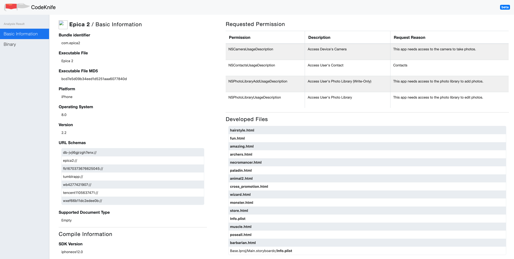
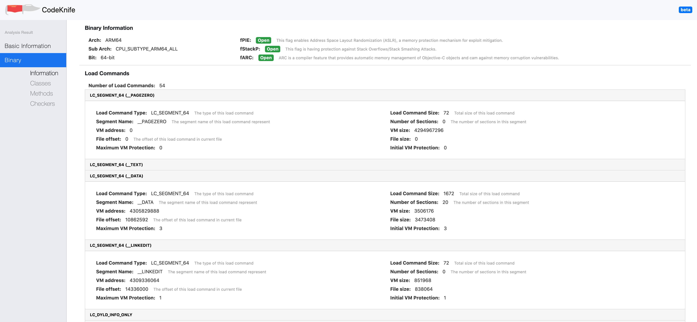
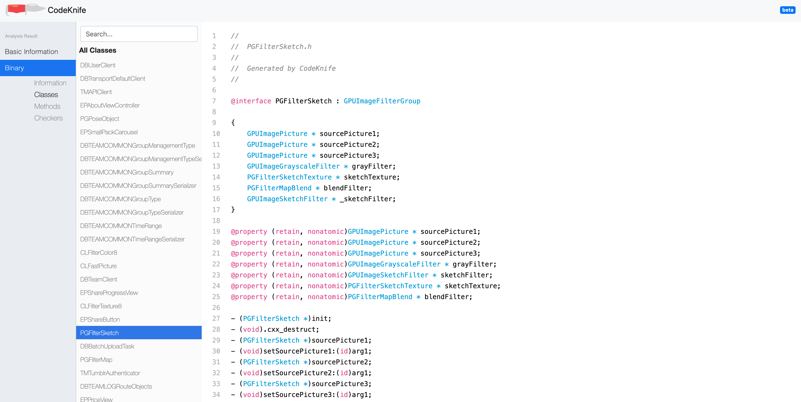
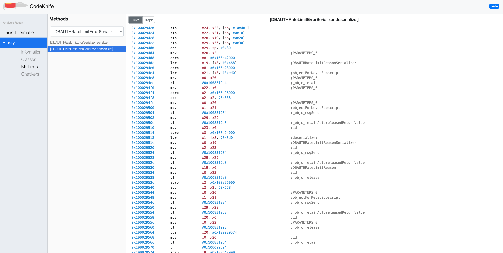
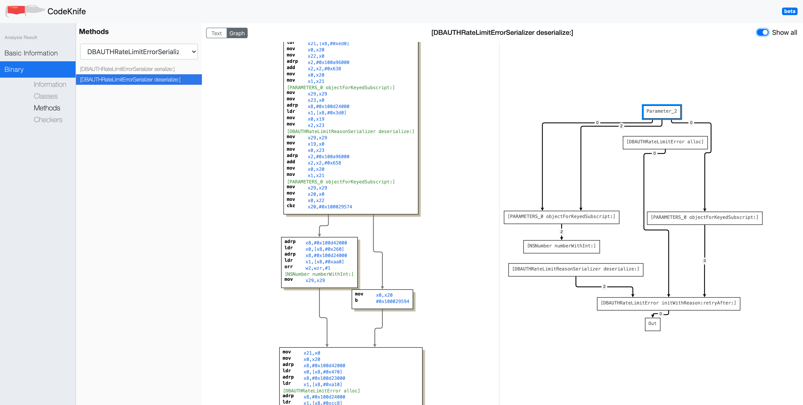
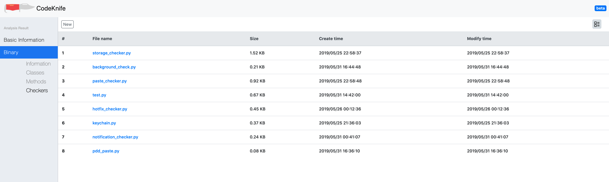
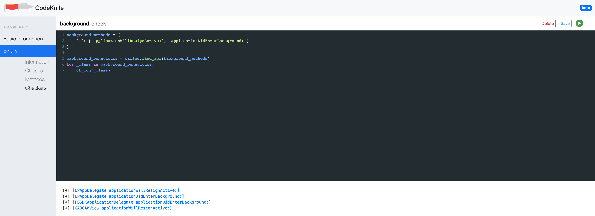

# CodeKnife

*针对已砸壳的 iOS 应用程序的静态分析工具。*（本科毕设项目，鲁棒性较差）

## 环境要求

* [Python 3](https://www.python.org/): 一种知名编程语言
* [Flask](http://flask.pocoo.org/): 用 Python 写的轻量 Web 框架
* [Capstone](https://github.com/aquynh/capstone): 轻量跨平台的多架构的反汇编框架。
* [MongoDB](https://www.mongodb.com/)：非关系型数据库
* pip3 install graphviz
* pip3 install tqdm

## 功能

在执行当前系统之前，需要先在默认端口执行 `MongoDB`（27017）：

```sh
$ mongod -dbpath=<db_pat>
```

然后，进入 *CodeKnife/view* 目录，执行下列命令启动：

```sh
$ python3 home.py
```

之后访问 *http://127.0.0.1:5000* 可以访问系统。

### 基本分析

您可以选择任何脱壳的 **.ipa** 或 **.app** 文件进行上传，在默认情况下可以查看基本分析。

在此功能中，您可以查看此应用程序的基本信息，有关应用程序捆绑包中的可执行文件的MD5，权限和一些开发相关的文件（Developed Files）。

### 二进制分析

在二进制分析模块中，首先可以查看当前 iOS 应用程序的所有加载的段。此外，可以查看以下详细信息：

#### 类

如果选择左侧的**类**选项卡，则可以看到当前应用程序中的所有**类**，并且在选择任何类时，都可以看到有关该类，属性和方法的详细信息。 如果类太多，可以搜索类名称来进行检索。

#### 方法

在**方法**选项卡中，您可以看到当前应用程序的所有方法。选择任何方法时，都可以看到此方法的 **CFG** 和 **DFG**，此外，在顶部工具栏中，可以切换到代码模式以查看详细的指令。

#### 检测器

在**检查器**选项卡中，您可以看到可以执行以检查该应用程序方法的一些脚本。 例如，如果选择 **background_check**，则可以看到如下脚本：

```python
background_methods = {
    '*': ['applicationWillResignActive:', 'applicationDidEnterBackground:']
}

background_behaviours = callee.find_api(background_methods)
for _class in background_behaviours:
    ck_log(_class)
```

如果单击右上角运行的绿色按钮，则可以在底部窗口中看到输出，该脚本可以输出任何类的 *applicationWillResignActive：* 和 *applicationDidEnterBackground：* 方法中调用的所有方法。

通常，可以自己编写脚本来进行检查操作。 要查找调用当前方法的方法，可以使用 *caller.find({method-pair})*，要查找当前方法中调用的方法，可以使用 *callee.find({class-method})*。

## 示例

在 *CodeKnife/Demos* 目录中，有一些演示应用程序。

### 示例展示

#### 基本信息

可以看到当前应用程序申请的权限，当前应用程序的编译信息，可执行文件的 **MD5** 编码，以及当前应用程序附带的 Developed Files 等信息。



#### 二进制基本信息

可以看到当前二进制程序的基本信息，以及 iOS 程序中所有的 Load Commands，包括加载的动态库等。



#### 所有类查看

可以查看当前二进制程序的所有的类，以及每个类的详细信息（成员变量、属性、方法）。



#### 所有方法查看

可以卡看当前二进制程序的所有方法（或者选择某个类，查看该类下面的所有方法），同时可以选择以指令的形式展示还是以图的形式展示，其中以指令形式展示如下图所示：



以控制流程图和数据流程图形式展示如下图所示：



#### 检测器

提供一些检查器可以对二进制程序中的信息进行查找（目前就是类似于交叉引用信息，后续可以添加一些新功能，例如数据依赖等）：



检测器执行效果如下图所示：


